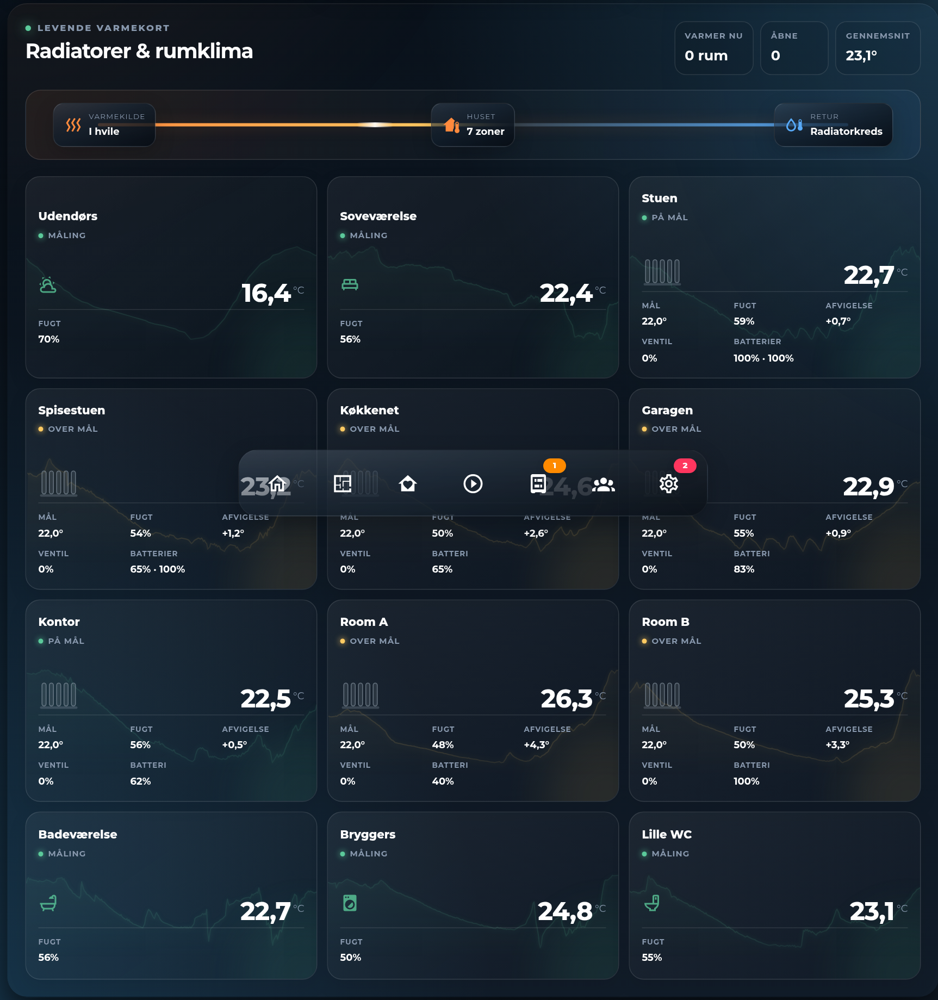

# HA Radiator Overview Card



A Home Assistant Lovelace card that shows every heated room in the house as one
animated overview: a heat-source-to-house flow diagram at the top, and a card per
room below with current temperature, a background sparkline of recent history,
target/humidity/deviation, valve position and battery level (when available), and
an animated radiator glow while a room is actively heating.

Works with any `climate` entity that exposes `current_temperature` / `temperature`,
and degrades gracefully room by room — a room with only a temperature sensor still
renders (as a plain sensor card), and any missing attribute (humidity, valve,
battery) just leaves that metric out instead of erroring.

Plain JavaScript, no build step — copy the file in and register it as a dashboard
resource.

## Installation

### HACS (custom repository)

1. In HACS, go to **Frontend** → the three-dot menu → **Custom repositories**.
2. Add `https://github.com/MRDonnii/ha-radiator-overview-card` as type **Dashboard**.
3. Install **HA Radiator Overview Card** and add the resource if HACS doesn't do it
   automatically.

### Manual

1. Download `ha-radiator-overview-card.js` from the latest release (or this repo).
2. Copy it to `config/www/community/ha-radiator-overview-card/ha-radiator-overview-card.js`.
3. Add it as a dashboard resource:
   ```yaml
   url: /local/community/ha-radiator-overview-card/ha-radiator-overview-card.js
   type: module
   ```

## Usage

Add the card via the dashboard editor (search for "Radiator Overview") or in YAML:

```yaml
type: custom:ha-radiator-overview-card
title: Radiators
animation: true
history_hours: 24
rooms:
  - name: Living room
    climate: climate.living_room
    temperature: sensor.living_room_temperature
    humidity: sensor.living_room_humidity
    window: binary_sensor.living_room_window
    comfort: sensor.living_room_comfort
  - name: Bedroom
    climate: climate.bedroom
    temperature: sensor.bedroom_temperature
  - name: Garage
    temperature: sensor.garage_temperature
    icon: mdi:garage
```

Only `name` is required per room. Any room without a `climate` entity renders as a
plain sensor tile (with `icon`, default `mdi:home-thermometer-outline`) instead of
the animated radiator graphic.

The card reads the standard `climate` attributes directly, so no extra template
sensors are needed for a typical setup:

- `current_temperature` / `temperature` for the current/target readings
- `current_humidity` (or a separate `humidity` sensor) for humidity
- `calibration_balance` (as exposed by [Better Thermostat](https://github.com/KartoffelToby/better_thermostat)) for valve position, read from whichever configured `climate` entity carries it — any integration exposing the same attribute shape works too
- `batteries` (a map of `entity_id -> {battery}}`, also a Better Thermostat attribute) for the battery readout — optional, silently omitted if absent

## Configuration reference

| Key | Description |
|---|---|
| `title` | Card header text |
| `animation` | Toggle CSS animations (default `true`) |
| `history_hours` | Hours of history behind each room's background sparkline (default `24`) |
| `rooms` | List of room objects, see below |

### Room object

| Key | Description |
|---|---|
| `name` | Room label (required) |
| `climate` | `climate` entity — enables target temp, valve %, battery and the animated radiator graphic |
| `temperature` | Temperature sensor — used for the history sparkline, and as the current-temperature fallback when no `climate` entity is set |
| `humidity` | Humidity sensor — only used when the `climate` entity doesn't already expose `current_humidity` |
| `window` | `binary_sensor` — an open window is shown as a paused/neutral state instead of heating |
| `comfort` | Entity with an `is_comfortable` attribute — used as a secondary signal for the room's status tone |
| `icon` | MDI icon for rooms without a `climate` entity (default `mdi:home-thermometer-outline`) |

Clicking a room with a `climate` entity opens that entity's more-info dialog.

## License

MIT — see [LICENSE](LICENSE).
